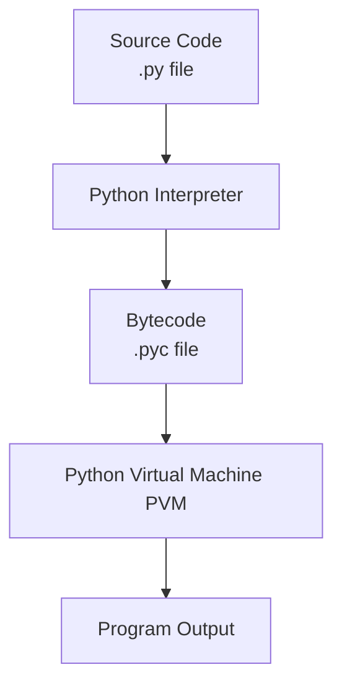

# 1. Python Basics

# Table of contents

1. Introduction to Python
2. Python runtime environment: Interpreter and execution flow
3. Installation: Python setup, virtual environments, package managers (pip)
4. Variables and Literals
5. Variable declaration, naming conventions, dynamic typing
6. Literals: Integers, floats, strings, booleans
7. Basic Input and Output
8. Input handling with input()
9. Output formatting with f-strings, format(), and % operator
10. Type Casting
11. Implicit and explicit type conversion

---

## 1. Introduction to Python

Python is a high-level, interpreted programming language known for its clear syntax and readability. Created by Guido van Rossum and first released in 1991, its design philosophy emphasizes code readability with its notable use of significant whitespace.

**Key Features:**

- **Easy to Learn:** Simple syntax, making it ideal for beginners.
- Versatile:** Used in Web Development, Data Science, Artificial Intelligence, Automation, Scientific Computing, and more.
- **Interpreted:** Code is executed line-by-line, which simplifies debugging.
- **Large Community and Ecosystem:** A vast collection of libraries and frameworks (e.g., Django, Flask, Pandas, NumPy) supported by a huge community.

## 2. Python Runtime Environment: Interpreter and Execution Flow

When you write Python code, you are writing a text file (e.g., `my_script.py`). This code is not directly understood by the computer's hardware. The **Python Interpreter** is a program that reads your Python code and executes the instructions.

**Execution Flow:**

1. You write your source code in a `.py` file.
2. The Python Interpreter reads the file.
3. The interpreter **compiles** the source code into a simpler, intermediate language called **bytecode** (this happens behind the scenes and is stored in `.pyc` files).
4. The Python **Virtual Machine (PVM)**, the runtime engine of Python, then executes this bytecode line-by-line.



## 3. Installation and Setup

### Python Setup

1. Download the latest version of Python from the official website: [https://www.python.org/downloads/](https://www.python.org/downloads/)
2. Run the installer.
    - **Windows/macOS:** Ensure you check the box that says "Add Python to PATH".
    - **Linux:** Python often comes pre-installed. You can use your package manager (e.g., `apt`, `yum`) if needed.

### Virtual Environments

A virtual environment is an isolated workspace for a Python project. This allows you to manage dependencies for different projects separately, preventing version conflicts.

**Creating a Virtual Environment:**

```bash
# Create a virtual environment named 'myenv'
python -m venv myenv
```

**Activating a Virtual Environment:**

- **Windows:**
    
    ```bash
    myenv\\Scripts\\activate
    ```
    
- **macOS/Linux:**
Once activated, your command prompt will change, showing the name of the active environment.
    
    ```bash
    source myenv/bin/activate
    ```
    

### Package Managers (pip)

`pip` is the standard package manager for Python. It is used to install and manage software packages written in Python.

**Common Commands:**

- Install a package: `pip install package_name`
- Install a specific version: `pip install package_name==1.4.2`
- Uninstall a package: `pip uninstall package_name`
- List installed packages: `pip list`

## 4. Variables and Literals

### Variable Declaration and Naming Conventions

A **variable** is a named location used to store data in memory. Think of it as a label for a value.

**Declaration:** In Python, you declare a variable by simply assigning a value to a name. No special keyword is needed.

```python
message = "Hello, World!"  # The variable 'message' now holds the string "Hello, World!"
count = 100                # The variable 'count' now holds the integer 100
```

**Naming Conventions:**

- Must start with a letter (a-z, A-Z) or an underscore (`_`).
- The rest of the name can contain letters, numbers, and underscores.
- Names are case-sensitive (`myVar` and `myvar` are different).
- Use descriptive names (e.g., `user_age`, `first_name`).
- By convention, use `snake_case` for variable names (e.g., `my_variable_name`).

### Dynamic Typing

Python is **dynamically typed**. This means you don't have to declare the type of a variable when you create it. The interpreter infers the type based on the value you assign.

```python
x = 5      # x is an integer
x = "Five" # Now x is a string. This is allowed!
```

### Literals

**Literals** are raw data given in a variable. They represent fixed values in the code.

- **Integers:** Whole numbers, positive or negative.
    
    ```python
    age = 25
    temperature = -10
    ```
    
- **Floats:** Numbers containing a decimal point.
    
    ```python
    height = 5.9
    pi = 3.14159
    ```
    
- **Strings:** A sequence of characters enclosed in single, double, or triple quotes.
    
    ```python
    name = 'Alice'
    greeting = "Hello, there!"
    paragraph = """This is a
    multi-line string."""
    ```
    
- **Booleans:** Represents either `True` or `False`.
    
    ```python
    is_active = True
    is_raining = False
    ```
    

## 5. Basic Input and Output

### Input Handling with `input()`

The `input()` function is used to take input from the user via the keyboard. It always returns the input as a **string**.

```python
name = input("Enter your name: ")
# User types "Bob" and presses Enter
print(name) # Output: Bob
print(type(name)) # Output: <class 'str'>

# To get a number, you must convert the string
age = int(input("Enter your age: "))
```

### Output Formatting

1. **f-strings (Formatted String Literals - Recommended):**
Embed expressions inside string literals using `{}`.
    
    ```python
    name = "Charlie"
    age = 30
    print(f"My name is {name} and I am {age} years old.")
    # Output: My name is Charlie and I am 30 years old.
    ```
    
2. **`str.format()` method:**
Uses `{}` as placeholders which are replaced by the arguments passed to the `format()` method.
    
    ```python
    item = "book"
    price = 15.99
    print("The {} costs ${:.2f}".format(item, price))
    # Output: The book costs $15.99
    ```
    
3. **`%` operator (Older method - deprecated):**
Uses `%s` for strings, `%d` for integers, `%f` for floats.
    
    ```python
    score = 95
    print("Your score is %d out of 100" % score)
    # Output: Your score is 95 out of 100
    ```
    

## 6. Type Casting

Type casting is the process of converting a variable from one data type to another.

### Implicit Type Conversion

The Python interpreter automatically converts one data type to another without any user involvement. This usually happens when you perform operations on mixed types.

```python
# Integer is implicitly converted to float
integer_num = 10
float_num = 5.5
result = integer_num + float_num # 10 + 5.5

print(result)        # Output: 15.5
print(type(result))  # Output: <class 'float'>
```

### Explicit Type Conversion

You explicitly convert the data type using built-in functions like `int()`, `float()`, `str()`, etc.

```python
# Converting string to integer
num_str = "100"
num_int = int(num_str)
print(num_int * 2) # Output: 200

# Converting integer to string
age = 25
message = "I am " + str(age) + " years old."
print(message) # Output: I am 25 years old.

# Converting float to integer (truncates the decimal part)
price = 9.99
whole_price = int(price)
print(whole_price) # Output: 9
```

**Common Type Conversion Functions:**

- `int()` - constructs an integer from a float (by truncation) or a string (if the string represents a whole number).
- `float()` - constructs a float from an integer or a string.
- `str()` - constructs a string from any object.

---